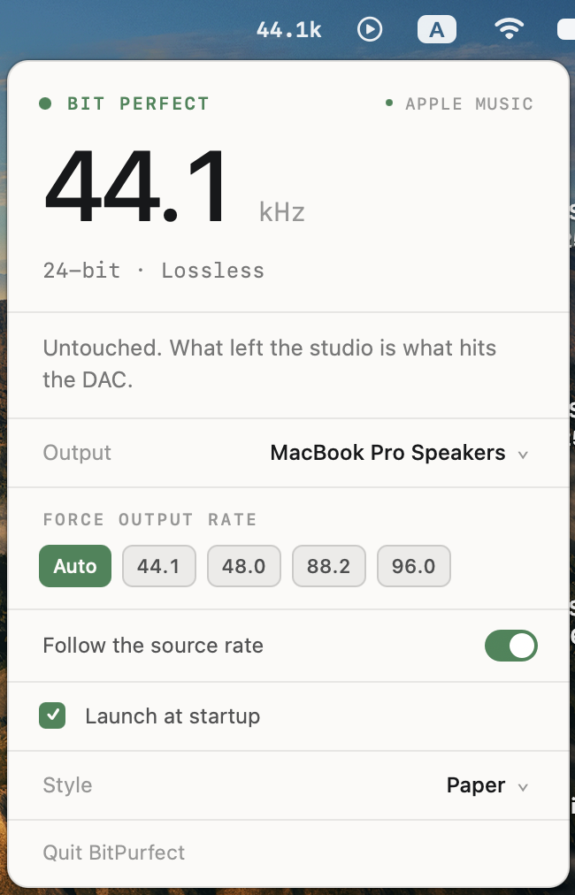
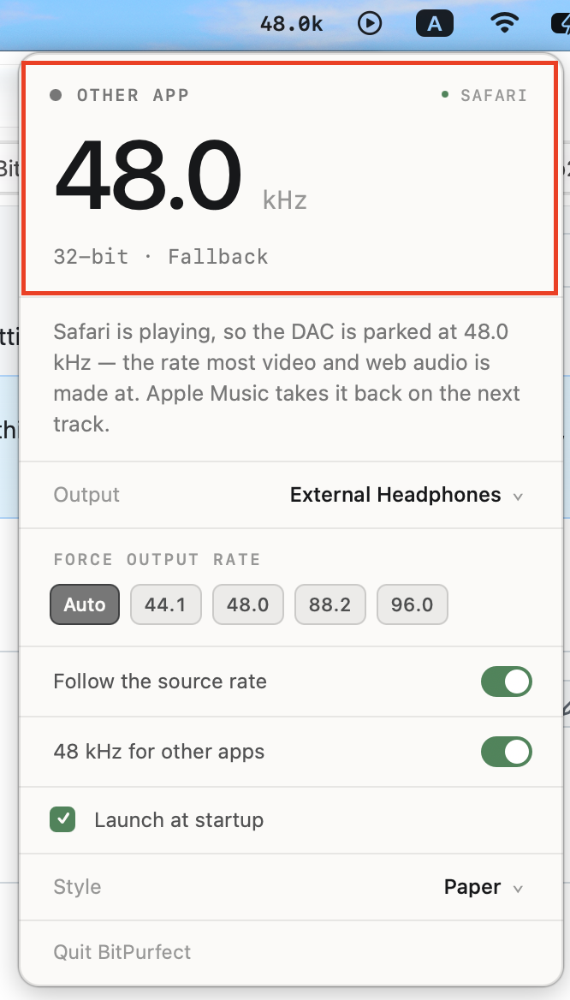

# BitPurfect

A macOS menu bar app that keeps your DAC on the same sample rate as whatever Apple Music is
playing — and stops it clicking between tracks.

macOS doesn't do either of these things on its own. Your output device sits on whatever sample
rate Audio MIDI Setup was last left on, and Core Audio quietly resamples everything else to match.
Play a 96 kHz Hi-Res track on a device parked at 44.1 kHz and that is what you hear: 96 kHz,
resampled, whatever the badge in Apple Music says.

BitPurfect reads the rate Apple Music is actually decoding and follows it, so the bits reaching
your DAC are the bits that left the studio.

<p align="center">
  
</p>

<p align="center"><em>The menu bar reads the live output rate. The panel says whether it's bit
perfect and why — here in the Paper theme.</em></p>

---

## Anti-pop, for sensitive IEMs

If you use efficient IEMs on an outboard DAC, you'll know the sound: a **click or thump when the
music pauses**, when a track ends, or a moment after you stop listening. On sensitive gear it can
be genuinely startling, and on some DACs it's loud enough to be unpleasant.

It isn't your music. Most USB DACs power down their output stage when the audio stream goes idle,
and it's the **wake-up** that makes the noise — the output relay closing, charge pumps spinning
back up. The quieter and more efficient your IEMs, the more of that you hear.

**BitPurfect's fix is to never let the DAC fall asleep.** It holds a silent stream open on the
device, so there's no standby to wake from and nothing to click.

The part that matters to anyone chasing bit-perfect playback is *what* that silent stream
contains:

- **While Apple Music is playing**, it writes **exact digital zeros**. Summed into the mix, zeros
  leave every bit of the music untouched. A bit-perfect path stays bit perfect — this costs you
  nothing.
- **When nothing is playing**, it writes dither at roughly **-120 dBFS**. That's non-zero, which
  is deliberate: some DACs watch for digital silence rather than for an idle USB stream, and would
  sleep through pure zeros. It sits about 20 dB below the noise floor of any 16-bit source, so it
  is inaudible even on high-sensitivity IEMs at listening volume.

It only runs where the problem actually exists — **wired external DACs** (USB, Thunderbolt,
FireWire, PCI, DisplayPort, HDMI, AVB). It's skipped for the Mac's own headphone jack, which
doesn't pop, and for Bluetooth and AirPlay, where holding a wireless link open streaming silence
would cost battery for no benefit. On those, the row doesn't even appear.

It's on by default, and the panel tells you the truth about it rather than what you asked for: a
live **HOLDING DAC AWAKE** badge when the stream is genuinely running, and a plain warning if it
couldn't be opened.

### One pop it can't remove

Honesty about the limits: anti-pop eliminates the **standby** pop — pauses, gaps, idle time. It
does not eliminate a click caused by an actual **sample-rate change**, because the DAC has to
re-lock its clock when the rate changes, and some DACs click when they do. That is inherent to
following the source rate.

If your DAC is one of those and you'd rather have silence than bit-perfect playback, the **Force
output rate** row is the escape hatch: pin one rate, accept that everything gets resampled to it,
and the DAC never re-locks. The panel will honestly report itself as "Resampled" while you do.

---

## What else it does

- **Follows the source rate.** 44.1, 48, 88.2, 96, 176.4, 192 kHz and up — whatever your DAC
  supports.
- **Respects clock family when it can't match exactly.** On a device that stops at 96 kHz, a
  176.4 kHz source goes to **88.2 kHz** — an exact 2:1 decimation — not to the numerically closer
  96 kHz, which would be a messy 1.8375:1 resample. Output is always the source rate, an integer
  ratio of it, or the nearest rate available if the device offers nothing in that family.
- **Holds the rate.** If Audio MIDI Setup or another app moves your device's rate, BitPurfect puts
  it back.
- **Tells you when it isn't bit perfect, and why.** "Resampled" with a plain-language reason,
  rather than a green light that means nothing.
- **48 kHz for other apps.** When something that isn't Apple Music takes over the audio — a video
  in a browser, Spotify, a podcast — the DAC drops to 48 kHz rather than sitting on whatever the
  last track needed. 48 kHz is what video, web audio and system sound are authored at, so the
  common case stops being resampled too. Apple Music takes the rate back on the next track. On by
  default; see the caveats below.
- **Force output rate.** Pin a rate manually; tap Auto to hand control back.
- **Four themes** — Graphite, Paper, Liquid glass (real `NSGlassEffectView` on macOS 26+), Ink.
- **Menu bar readout** of the current output rate.
- **Launch at login.**

Lossy streams report no rate at all, because only the lossless decoder logs one. The app says so
rather than guessing.

### What "other apps" covers

<p align="center">
  
</p>

<p align="center"><em>Safari has the audio, so the DAC sits at 48 kHz. The sub-line reads
"32-bit · Fallback" because that output offers no 24-bit format at 48 kHz — the rate moved, the
depth didn't, and the panel says so.</em></p>

The fallback keys off the system's now-playing information, so it sees apps that publish there —
browsers, Spotify, Podcasts, TV, most media players. Measured on this machine: Safari playing
audio publishes correctly (as `com.apple.WebKit.GPU`, which the app relabels to "Safari").

It does **not** see apps that never register as now-playing. QuickTime Player playing a plain
audio file publishes nothing at all, and neither do games, alert sounds or `afplay`. For those the
rate simply stays where it is — the app would rather do nothing than guess.

The **24-bit** half of "48 kHz / 24-bit" is best-effort, and often won't apply. Bit depth can only
be set through a stream's physical format, and a device only offers what its driver publishes:
every output on this Mac exposes a 32-bit container at 48 kHz and no 24-bit option at all. Where
24-bit is offered it's selected; where it isn't, the rate still moves and the depth is left alone,
which the panel reports honestly rather than claiming a depth it didn't set.

---

## Install

Download the `.dmg` from [Releases](https://github.com/Booloo26/BitPurfect/releases), drag
BitPurfect to Applications, and launch it.

**Builds here are signed with an anonymous (ad-hoc) signature, not notarized**, so macOS will
block the first launch. To allow it:

1. Double-click the app. macOS refuses to open it.
2. Open **System Settings → Privacy & Security**, scroll to the message about BitPurfect, and
   click **Open Anyway**.
3. Confirm.

Recent macOS removed the old right-click → Open shortcut, so that System Settings trip is the only
route. If you'd rather do it from a terminal:

```bash
xattr -d com.apple.quarantine /Applications/BitPurfect.app
```

Nothing leaves your machine. No network access, no analytics, no accounts.

### Requirements

- **Apple Silicon Mac.** arm64 only — see [Why it's arm64-only](#why-its-arm64-only).
- **Apple Music with Lossless enabled** (Settings → Playback → Audio Quality).
- No admin account needed.

**Verified on macOS 27.0 only.** The minimum is set to 14.0 and nothing in the code needs more —
the Liquid glass theme is gated to macOS 26+ and falls back cleanly — but detection depends on a
Core Audio log line whose wording Apple could change in any release. It has not been tested below
27. If detection stops working after a macOS update, that log line is the first thing to check.

---

## How it works

Apple Music doesn't expose the sample rate of what it's playing through any API. It does log it.
Core Audio's ALAC decoder writes a line naming the rate and bit depth whenever it builds a
decoder:

```
ACAppleLosslessDecoder.cpp:681 (0x...) Input format: 2 ch, 96000 Hz, alac (0x00000003) from 24-bit source
```

BitPurfect watches for those lines and matches the output device to them. Two findings shape the
implementation, both measured rather than assumed:

**Detection runs `/usr/bin/log stream` as a subprocess, not `OSLogStore` in-process.**
`OSLogStore` turns out to be unusable in both directions. A handle held across reads is a snapshot
frozen at open time — reopened 12 seconds later, a fresh store saw 13 seconds of entries the held
one never showed, so every read after launch silently found nothing. Opening a fresh store per
read instead leaks a `com.apple.loggingsupport.stream` thread on every open, which are never
reclaimed; that reached 70 threads and 218 MB before reads stopped completing at all and the UI
locked up. A subprocess has neither problem: it's live by definition, and the kernel reclaims
everything when it exits. It's also push-based, so a format change is seen the moment Music logs
it instead of being polled for.

**Music logs a decoder line only when it *creates* a decoder,** then reuses it for every following
track in the same format. Long runs of tracks log nothing at all, and resuming a paused track logs
nothing. So a detected format is kept until a genuinely different one is reported, and a one-shot
`log show` fills in the format when the app starts mid-track.

---

## Building

```bash
make run      # build, bundle, sign, launch
make stop     # quit the app and its two helper processes
make icon     # regenerate AppIcon.icns from Packaging/GenerateIcon.swift
make clean
```

Swift Package Manager and the Xcode Command Line Tools are enough; full Xcode is not required.

`make run` signs with a local self-signed certificate named `BitPurfect Dev`, which you'll need to
create once:

```bash
openssl req -x509 -newkey rsa:2048 -days 3650 -nodes \
  -keyout dev.key -out dev.crt -subj "/CN=BitPurfect Dev" \
  -addext "keyUsage=critical,digitalSignature" \
  -addext "extendedKeyUsage=codeSigning"
openssl pkcs12 -export -in dev.crt -inkey dev.key -out dev.p12 -password pass:dev
security import dev.p12 -k ~/Library/Keychains/login.keychain-db -P dev -T /usr/bin/codesign
```

A stable local identity is used rather than ad-hoc on purpose: an ad-hoc signature changes on
every build, and anything macOS keys to the app's identity — a Login Item approval, for instance —
would need re-approving each time.

### Layout

| Path | What's in it |
| --- | --- |
| `Sources/BitPurfect/Detection/` | `log stream` subprocess and decoder-line parser; now-playing bridge |
| `Sources/BitPurfect/Engine/` | Rate decisions, display state |
| `Sources/BitPurfect/Audio/` | Core Audio device access, rate selection, anti-pop stream |
| `Sources/BitPurfect/UI/` | Menu bar panel and its four themes |
| `Packaging/` | `Info.plist`, icon generator, generated `.icns` |

### Releasing

| | `make dist` | `make dist-adhoc` |
| --- | --- | --- |
| Needs | Apple Developer Program | nothing |
| Recipient | double-clicks, it opens | must approve once in System Settings |

Both write `.build/dist/BitPurfect-<version>.dmg` containing the app, an `/Applications` symlink,
`LICENSE` and `THIRD-PARTY-NOTICES.md`. That last file isn't optional — the bundled dependencies
are MIT and BSD-3, and both require their copyright notices to accompany a binary.

For the notarized path, store a credential once and pass your identity:

```bash
xcrun notarytool store-credentials "notary" \
  --apple-id "you@example.com" --team-id TEAMID --password APP_SPECIFIC_PASSWORD

make dist DIST_IDENTITY="Developer ID Application: Your Name (TEAMID)"
```

That signs with hardened runtime, builds the image, submits and waits, staples the ticket, and
verifies. **Hardened runtime is the one part of this that hasn't been exercised**, and it's exactly
the kind of change that can break the perl → MediaRemote bridge, which loads a dylib into an
Apple-signed binary. If now-playing detection stops working under a hardened build, add an
entitlements file granting `com.apple.security.cs.disable-library-validation`.

The App Store is not an option: the now-playing bridge reaches a private framework through
`/usr/bin/perl`, which App Review rejects, and sandboxing would break log reading anyway.

### Why it's arm64-only

`swift build --arch arm64 --arch x86_64` fails linking the x86_64 slice:

```
"__swift_FORCE_LOAD_$_swiftCompatibility56", referenced from: ...
ld: symbol(s) not found for architecture x86_64
```

The Swift back-deployment compatibility archives shipped with the Command Line Tools contain
**arm64 and arm64e slices only**, and the dependencies' older deployment targets pull those
archives in. Full Xcode ships the x86_64 slices; the Command Line Tools don't. So a universal build
needs Xcode installed.

In practice it matters less than it sounds: Intel Macs stop at macOS 15, detection here is only
verified on macOS 27, and the toolchain now warns that x86_64 is deprecated for recent deployment
targets.

---

## Licence

MIT — see [LICENSE](LICENSE).

Bundled dependencies and their notices are listed in
[THIRD-PARTY-NOTICES.md](THIRD-PARTY-NOTICES.md): [SimplyCoreAudio](https://github.com/rnine/SimplyCoreAudio)
(MIT), [mediaremote-adapter](https://github.com/ejbills/mediaremote-adapter) (BSD 3-Clause, a fork
of [ungive/mediaremote-adapter](https://github.com/ungive/mediaremote-adapter) where the technique
originates), and [Swift Atomics](https://github.com/apple/swift-atomics) (Apache 2.0).

[LosslessSwitcher](https://github.com/vincentneo/LosslessSwitcher) (GPLv3) proved this was possible
and is where the decoder-log approach comes from. No code was taken from it — only the idea that
the log line exists.

The UI follows design 1a ("Minimal · one number, one verdict") from the Bit Perfect design
document; the icon is design 1d ("Sample bars").
